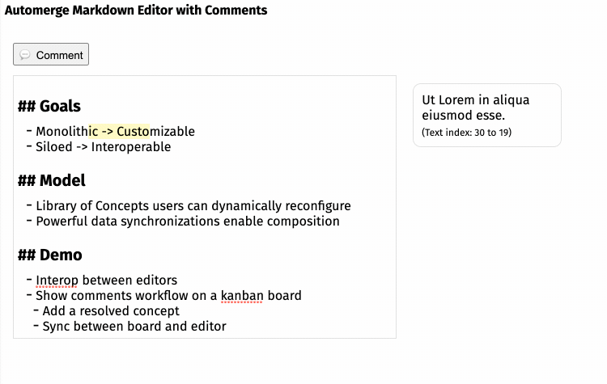

# Automerge Slate Playground

[Try it out](https://automerge-slate-playground.netlify.app/)

A toy demo integration of [Automerge](https://github.com/automerge/automerge) with [Slate](https://www.slatejs.org/examples)

This builds on the new Automerge Cursors functionality to support adding annotations to text. Currently includes two demos:

- A markdown doc, with inline comments
- A minimal rich text doc with bold/italic formatting

A next demo to add might be broader rich text support for things like lists, blockquotes, images, etc.

# Run locally

`yarn`

`yarn start`

Open [localhost:8181](http://localhost:8181) to see the app

# How it works

- Automerge doc is the source of truth. The entire text content is stored as a single Automerge.Text string. Comments and rich text formatting are stored as an array of annotations, per the [OAFS](https://github.com/automerge/automerge/issues/193) idea; also similar to [atjson](https://github.com/CondeNast/atjson).
- Doesn't meaningfully use Slate's tree representation. Just treats the doc as a single text node.
- Intercepts insert/delete operations from the Slate editor, and converts to corresponding Automerge Text ops to edit

# Todos

- Add a second client window with option to enable/disable sync, for testing concurrent editing
- Figure out TS types for Cursors
